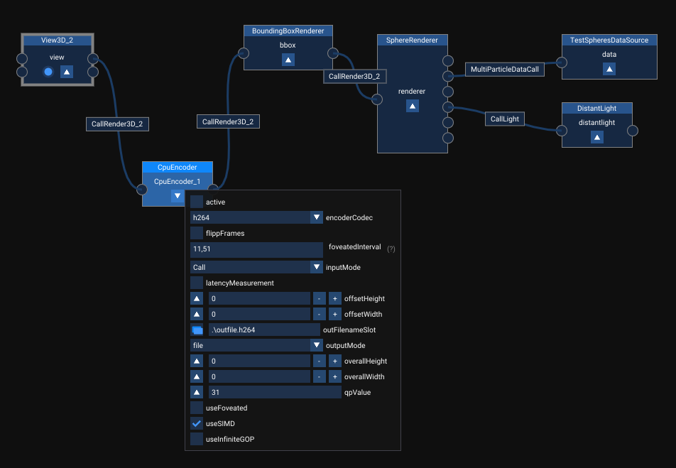

# Encoder plugin
This plugin allows to use CPU and GPU based video encoders in MegaMol to encode, and either save to a file or transmit the encoded bitstream via UPD or MPI, the content of MegaMol calls (only the CallRender3D_2 for now) or an incoming (via MPI) bitstreams.

The plugin depends on [x264](https://www.videolan.org/developers/x264.html) and [x265](https://www.videolan.org/developers/x265.html) for the CPU based encoding. Both originate from VideoLAN and are open source projects that provide an SDK for video encoding using the h264 codec (x264) and the h265 codec (x265).
The figure below shows the CpuVideoEncoder module in an example graph in MegaMol.

## Building
[x264](https://www.videolan.org/developers/x264.html) is not included in this package, however it is required for this plugin to build.

For Windows:

Step 1: Install [MSYS2](https://www.msys2.org/)

Step 2: Update MSYS2 (open msys2.exe) with the command: pacman -Syuu  (until it says there are no further updates)

Step 3: Install at least "mingw-w64-x86_64-toolchain" (I used the full toolchain: pacman -S --needed base-devel mingw-w64-i686-toolchain mingw-w64-x86_64-toolchain \ git subversion mercurial \ mingw-w64-i686-cmake mingw-w64-x86_64-cmake)

Step 4: Clone "stable" branch from https://code.videolan.org/videolan/x264/-/tree/stable

Step 5: Launch (x64 Native Tools Command Prompt for VS 2019)

Step 6: From that VS2019 command prompt, run "E:\Programme\msys64\msys2_shell.cmd -mingw64 -use-full-path" (replace E:\Programme\msys64\ with the correct path)

Step 7: From inside the MSYS2 shell, go to the location of the cloned repro from Step 4

Step 8: From inside the MSYS2 shell run CC=cl ./configure --enable-static --prefix=/e/Projects/CPUEncoding/x264/install --disable-cli (replace /e/Projects/CPUEncoding/x264 with the correct path to the repro)

Step 9: From inside the MSYS2 shell run make and then make install

Step 10: Copy the ".\megamol\externals\x264\x264Config.cmake" to the ".\x264\install\" folder (replace ".\x264\install\" with the path used by the --prefix command in Step 8)

Step 11: Set the x264_Dir to ".\x264\install\" (replace ".\x264\install\" with the path used by the --prefix command in Step 8)

For Linux:

Step 1: Clone "stable" branch from https://code.videolan.org/videolan/x264/-/tree/stable

Step 2: Run ./configure --enable-static --prefix=/e/Projects/CPUEncoding/x264/install --disable-cli (replace /e/Projects/CPUEncoding/x264 with the correct path to the repro)

Step 3: Run make and then make install

[x265](https://www.videolan.org/developers/x265.html) is included in this package but it requires NASM to offer the full performance.

Step 1: Install [NASM](https://www.nasm.us/pub/nasm/releasebuilds/?C=M;O=D) (Version 2.15.05 or newer) and check that the path does not contain a space!

Step 2: Add NASM to the PATH variable (only for Windows)

## Modules

This plugin has one module: the `CpuVideoEncoder` that uses either x264 or x265 for encoding and it can receive input from a MegaMol call or via MPI.
If MPI is used make sure that the input is interleaved BGR (BGRBGRBGR...BGR) values in the range of 0 to 255.

## Hints

The frames copied from OpenGL are upside down, the `CpuVideoEncoder` can flip the image, which takes between 0.7ms and 2.5ms with the median being 1.2ms (tested on an AMD Ryzen 7 1700X).
The QP value can be in the range of 1 to 51, with 1 producing the best and 51 producing the worst image quality.
The foveated interval determines the minimum and maximum QP value used inside of the foveated regions.
The offsetHeight, offsetWidth, overallHeight and overallWidth must be 0 in a non tiled environment.
They are required for the foveated encoding so that the encoder knows which part of the (tiled) display it is responsible for.
Only use an Infinite GOP length if the encoded bitstream is not saved to a file, as this setting will not produce key frames and therefore making it impossible to seek in the resulting video.
Foveated encoding uses a moving region of interest to improve the compression (see F. Frieß, M. Braun, V. Bruder, S. Frey, G. Reina, and T. Ertl. Foveated encoding for large high-resolution displays. IEEE Transactions on Visualization and Computer Graphics, 27(2):1850–1859, 2021. doi: 10.1109/TVCG.2020.3030445).